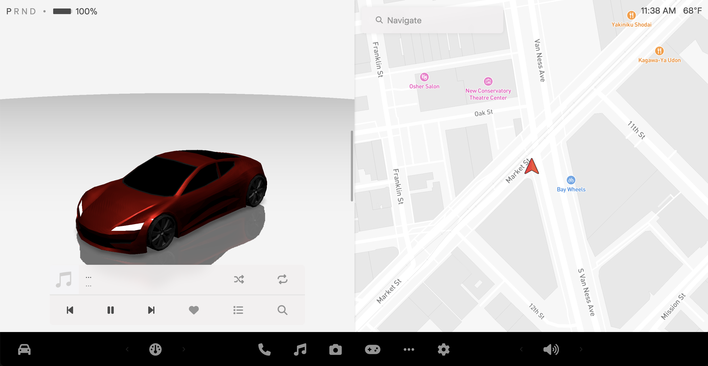
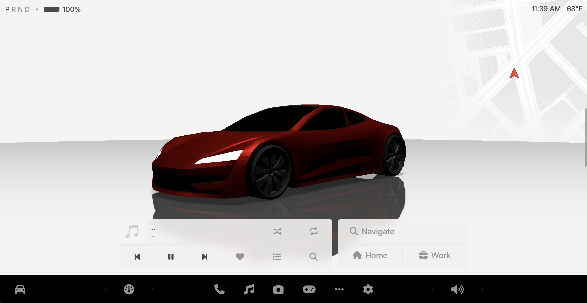

<h1 id="spark-ev-ui">spark-ev-ui</h1>

A recreation of the Tesla UI Interface, made in HTML, CSS, and JS for <a href="https://github.com/spark-ev">my EV project.</a>

A screenshot of a relatively recent version of the UI so far:

 

A video demonstration of using the UI:

<video width="640" height="480" controls>
  <source src="assets/videos/demo.mp4" type="video/mp4">
</video>
 

This UI could also be called a "Tesla UI Clone"
